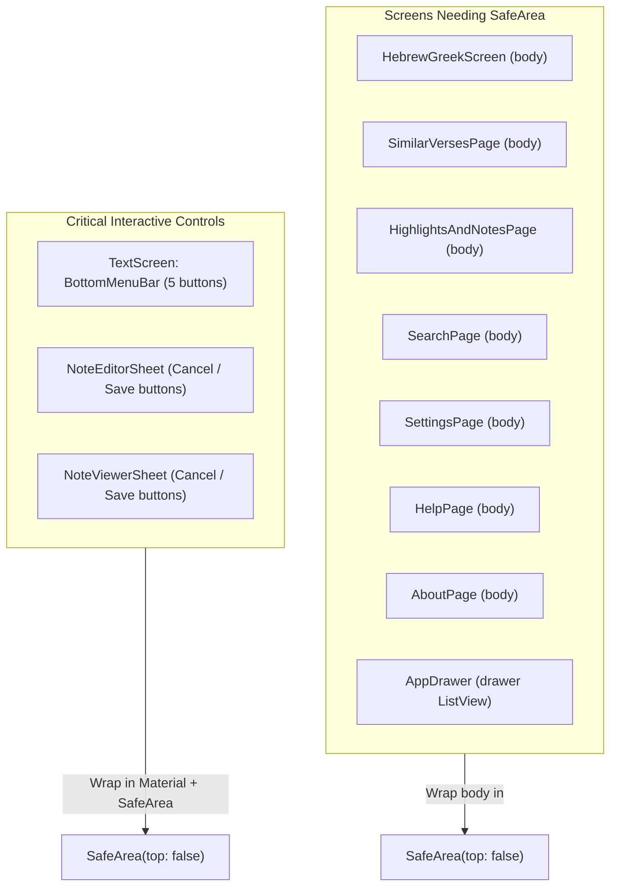

# Android Bottom SafeArea Architecture & Implementation Plan

## Goal Description
In recent versions of Android (Android 10+ and enforced edge-to-edge in Android 15), the system navigation bar (with Back, Home, and Recents buttons or gesture bar) is semi-transparent or transparent, drawing over the bottom of the application window. When screens or bottom sheets render buttons or content at the bottom of the screen without safe area insets, users cannot see or tap them because they are covered by the Android system buttons.

This document details the codebase research, identifies every affected screen and modal bottom sheet, categorizes existing safe area implementations, and provides a complete implementation plan to add `SafeArea` where needed.

---

## User Review Required

> [!IMPORTANT]
> **Key Architecture Decision: Scoped `SafeArea` vs. Global Screen `SafeArea`**
> - In `TextScreen` (the main Bible reading screen), the reading view (`ChapterText`) is intentionally designed to flow edge-to-edge behind the transparent navigation bar with an 80% screen-height scroll padding. The text itself is never trapped.
> - However, the floating action bar in `TextScreen` (`_buildBottomMenuBar()`), which slides up when text is selected (with buttons: **Highlight**, **Note**, **Copy**, **Greek/Hebrew**, **More**), sits directly on the bottom edge without safe area padding.
> - Therefore, `SafeArea(top: false)` will be wrapped specifically around the `BottomNavigationBar` in `TextScreen` within a `Material` widget (preserving the surface color to the screen edge), rather than wrapping the entire `TextScreen`.

---

## Codebase Research Findings

### 1. Components Most Critically Affected (Interactive Buttons Obscured)
These components have clickable buttons positioned directly against the screen's bottom edge:

1. **`TextScreen` Selection Menu Bar** ([`lib/ui/text/text_screen.dart`](../flutter_app/lib/ui/text/text_screen.dart))
   - **What's there**: `BottomNavigationBar` containing 5 crucial action buttons: `Highlight`, `Note`, `Copy`, `Greek/Hebrew`, and `More`.
   - **Issue**: Rendered inside `Align(alignment: Alignment.bottomCenter, ...)` with no `SafeArea`. On Android with 3-button navigation (~48dp high), all 5 action buttons and labels are covered by the Android system navigation bar.
2. **`NoteEditorSheet`** ([`lib/ui/text/note_editor_sheet.dart`](../flutter_app/lib/ui/text/note_editor_sheet.dart))
   - **What's there**: Bottom row containing `Cancel` and `Save` buttons.
   - **Issue**: `showModalBottomSheet` is called without `useSafeArea: true`, and the sheet uses `bottom: bottomInset + 16`. When the keyboard is not showing (or dismissed), `bottomInset == 0`, placing `Cancel` and `Save` 16dp from the bottom edge—directly under the Android 3-button system bar.
3. **`NoteViewerSheet`** ([`lib/ui/text/note_viewer_sheet.dart`](../flutter_app/lib/ui/text/note_viewer_sheet.dart))
   - **What's there**: Note content in view mode; `Cancel` and `Save` buttons in edit mode.
   - **Issue**: Same as `NoteEditorSheet`. When viewing a note or when keyboard is closed in edit mode, the buttons and content sit under the system navigation bar.

### 2. Secondary Screens (Scrollable Content / List Items Obscured at Bottom)
These screens have `Scaffold` bodies that extend to the screen bottom edge without `SafeArea`, causing the last item or bottom buttons to be covered when scrolled:

4. **`HebrewGreekScreen`** ([`lib/ui/hebrew_greek/hebrew_greek_screen.dart`](../flutter_app/lib/ui/hebrew_greek/hebrew_greek_screen.dart))
   - Bottom of lexicon markdown content, scripture reference links, and action chips (`Occurrences`, `Bible Hub`).
5. **`SimilarVersesPage`** ([`lib/ui/hebrew_greek/similar_verses/similar_verses_page.dart`](../flutter_app/lib/ui/hebrew_greek/similar_verses/similar_verses_page.dart))
   - Bottom items of the occurrences list view.
6. **`HighlightsAndNotesPage`** ([`lib/ui/annotations/highlights_and_notes_page.dart`](../flutter_app/lib/ui/annotations/highlights_and_notes_page.dart))
   - Bottom cards in both Highlights and Notes tabs, including card action buttons (`Delete highlight`, `Edit note`, `Delete note`).
7. **`SearchPage`** ([`lib/ui/search/search_page.dart`](../flutter_app/lib/ui/search/search_page.dart))
   - Bottom tiles in recent searches wrap and search result list view.
8. **`SettingsPage`** ([`lib/ui/settings/settings_page.dart`](../flutter_app/lib/ui/settings/settings_page.dart))
   - Bottom list tiles: "Export Annotations" and "Import Annotations".
9. **`HelpPage`** ([`lib/ui/help.dart`](../flutter_app/lib/ui/help.dart))
   - Bottom help card ("Additional tools").
10. **`AboutPage`** ([`lib/ui/about.dart`](../flutter_app/lib/ui/about.dart))
    - App and developer info links at the bottom.
11. **`AppDrawer`** ([`lib/ui/home/drawer.dart`](../flutter_app/lib/ui/home/drawer.dart))
    - Drawer items in landscape orientation or short screen devices.

### 3. Components Already Protected by `SafeArea` (No Change Needed)
The codebase already implements `SafeArea` in several places:
- **`HomePage`** ([`ui/home/home.dart:207`](../flutter_app/lib/ui/home/home.dart)): Wraps `_buildBookChooser()` in `SafeArea`.
- **`AudioPlayerBottomBar`** ([`ui/audio/audio_player_bottom_bar.dart:28`](../flutter_app/lib/ui/audio/audio_player_bottom_bar.dart)): Wrapped in `SafeArea(top: false)`.
- **`AnnotationDisambiguationSheet`** ([`ui/text/annotation_disambiguation_sheet.dart:47`](../flutter_app/lib/ui/text/annotation_disambiguation_sheet.dart)): Wrapped in `SafeArea`.
- **`HighlightPaletteSheet`** ([`ui/text/highlight_palette_sheet.dart:36`](../flutter_app/lib/ui/text/highlight_palette_sheet.dart)): Wrapped in `SafeArea`.
- **`ChapterTabsSheet`** ([`ui/tabs/chapter_tabs_sheet.dart:23`](../flutter_app/lib/ui/tabs/chapter_tabs_sheet.dart)): Uses `useSafeArea: true`.
- **`ReferenceModalSheet`** ([`ui/hebrew_greek/reference_modal_sheet.dart:75, 125`](../flutter_app/lib/ui/hebrew_greek/reference_modal_sheet.dart)): Uses `useSafeArea: true`.
- **`SettingsPage` Export Sheet** ([`ui/settings/settings_page.dart:199`](../flutter_app/lib/ui/settings/settings_page.dart)): Wrapped in `SafeArea`.
- **Dialogs** (`AlertDialog` / `SectionHeadingsDialog`): Automatically wrapped by Flutter's `DialogRoute`.

---

## Proposed Changes



---

### Component: Text Reader & Bottom Sheets (`lib/ui/text/`)

#### [MODIFY] [`text_screen.dart`](../flutter_app/lib/ui/text/text_screen.dart)
Wrap the `BottomNavigationBar` in `_buildBottomMenuBar()` with `Material` and `SafeArea(top: false)` so the background color fills to the screen edge while raising the 5 action buttons above Android's bottom navigation bar:

```dart
// lib/ui/text/text_screen.dart
Widget _buildBottomMenuBar() {
  return ValueListenableBuilder(
    valueListenable: _showBottomBarNotifier,
    builder: (context, showBar, child) {
      final language = _currentLanguage;
      final theme = Theme.of(context);
      final navBarBgColor = theme.bottomNavigationBarTheme.backgroundColor ??
          theme.colorScheme.surface;

      return Align(
        alignment: Alignment.bottomCenter,
        child: AnimatedSlide(
          offset: showBar ? Offset.zero : const Offset(0, 1),
          duration: const Duration(milliseconds: 200),
          curve: Curves.easeInOut,
          child: Material(
            color: navBarBgColor,
            elevation: 8,
            child: SafeArea(
              top: false,
              child: BottomNavigationBar(
                type: BottomNavigationBarType.fixed,
                selectedItemColor: theme.colorScheme.onSurface,
                unselectedItemColor: theme.colorScheme.onSurface,
                selectedFontSize: 12.0,
                unselectedFontSize: 12.0,
                items: [
                  const BottomNavigationBarItem(
                    icon: Icon(Icons.border_color),
                    label: 'Highlight',
                  ),
                  const BottomNavigationBarItem(
                    icon: Icon(Icons.edit_note),
                    label: 'Note',
                  ),
                  const BottomNavigationBarItem(
                    icon: Icon(Icons.content_copy),
                    label: 'Copy',
                  ),
                  BottomNavigationBarItem(
                    icon: _getLanguageIcon(language),
                    label: _getLanguageLabel(language),
                  ),
                  BottomNavigationBarItem(
                    icon: Icon(Icons.more_horiz, key: _moreKey),
                    label: 'More',
                  ),
                ],
                onTap: (index) => _handleBottomBarTap(index, language),
              ),
            ),
          ),
        ),
      );
    },
  );
}
```

#### [MODIFY] [`note_editor_sheet.dart`](../flutter_app/lib/ui/text/note_editor_sheet.dart)
Wrap the `Padding` in `SafeArea(top: false)` to lift `Cancel` and `Save` buttons above the system navigation bar:

```dart
// lib/ui/text/note_editor_sheet.dart
@override
Widget build(BuildContext context) {
  final bottomInset = MediaQuery.of(context).viewInsets.bottom;
  final theme = Theme.of(context);

  return SafeArea(
    top: false,
    child: Padding(
      padding: EdgeInsets.only(
        left: 20,
        right: 20,
        top: 16,
        bottom: bottomInset + 16,
      ),
      child: Column(...),
    ),
  );
}
```

#### [MODIFY] [`note_viewer_sheet.dart`](../flutter_app/lib/ui/text/note_viewer_sheet.dart)
Wrap the `Padding` in `SafeArea(top: false)` to lift note content and action buttons above the system navigation bar:

```dart
// lib/ui/text/note_viewer_sheet.dart
@override
Widget build(BuildContext context) {
  final bottomInset = MediaQuery.of(context).viewInsets.bottom;
  final theme = Theme.of(context);
  final colorScheme = theme.colorScheme;

  return SafeArea(
    top: false,
    child: Padding(
      padding: EdgeInsets.only(
        left: 20,
        right: 20,
        top: 16,
        bottom: bottomInset + 16,
      ),
      child: Column(...),
    ),
  );
}
```

---

### Component: Secondary Screens (`lib/ui/`)

Wrap each page's `Scaffold.body` in `SafeArea(top: false, child: ...)` so that list views, scroll views, and actions clear Android's bottom navigation bar without double-padding the top `AppBar`:

#### [MODIFY] [`hebrew_greek_screen.dart`](../flutter_app/lib/ui/hebrew_greek/hebrew_greek_screen.dart)
```dart
return Scaffold(
  appBar: AppBar(...),
  body: SafeArea(
    top: false,
    child: ValueListenableBuilder<int?>(...),
  ),
);
```

#### [MODIFY] [`similar_verses_page.dart`](../flutter_app/lib/ui/hebrew_greek/similar_verses/similar_verses_page.dart)
```dart
return Scaffold(
  appBar: AppBar(...),
  body: SafeArea(
    top: false,
    child: Column(...),
  ),
);
```

#### [MODIFY] [`highlights_and_notes_page.dart`](../flutter_app/lib/ui/annotations/highlights_and_notes_page.dart)
```dart
return Scaffold(
  appBar: AppBar(...),
  body: SafeArea(
    top: false,
    child: _isLoading ? ... : TabBarView(...),
  ),
);
```

#### [MODIFY] [`search_page.dart`](../flutter_app/lib/ui/search/search_page.dart)
```dart
return Scaffold(
  appBar: AppBar(...),
  body: SafeArea(
    top: false,
    child: ValueListenableBuilder<double>(...),
  ),
);
```

#### [MODIFY] [`settings_page.dart`](../flutter_app/lib/ui/settings/settings_page.dart)
```dart
return Scaffold(
  appBar: AppBar(...),
  body: SafeArea(
    top: false,
    child: ListenableBuilder(...),
  ),
);
```

#### [MODIFY] [`help.dart`](../flutter_app/lib/ui/help.dart)
```dart
return Scaffold(
  appBar: AppBar(...),
  body: SafeArea(
    top: false,
    child: ValueListenableBuilder<double>(...),
  ),
);
```

#### [MODIFY] [`about.dart`](../flutter_app/lib/ui/about.dart)
```dart
return Scaffold(
  appBar: AppBar(...),
  body: SafeArea(
    top: false,
    child: ValueListenableBuilder<double>(...),
  ),
);
```

#### [MODIFY] [`drawer.dart`](../flutter_app/lib/ui/home/drawer.dart)
```dart
child: Drawer(
  child: SafeArea(
    top: false,
    child: ListView(...),
  ),
),
```

---

## Verification Plan

### Automated Tests
1. **Run full existing test suite**:
   ```bash
   flutter test
   ```
   Ensures no regressions across all 223 existing widget and unit tests.
2. **Add new Safe Area verification tests**:
   Create a dedicated test file `test/safe_area_bottom_nav_test.dart` that injects a simulated bottom navigation bar padding (`MediaQueryData(padding: EdgeInsets.only(bottom: 48.0))`) and verifies:
   - `TextScreen`: When selection is active, `BottomNavigationBar` renders above the 48dp bottom margin.
   - `NoteEditorSheet`: `Cancel` and `Save` buttons are positioned at least 48dp above the bottom of the screen.
   - `NoteViewerSheet`: Content and buttons are positioned at least 48dp above the bottom of the screen.
   - `SettingsPage`, `HelpPage`, `AboutPage`: The `Scaffold` body contains a `SafeArea` with `top: false`.

### Manual Verification
1. Run app on an Android device or emulator configured with standard 3-button navigation (Back, Home, Recents).
2. Select any text in the Bible reader:
   - Verify that the bottom action bar (`Highlight`, `Note`, `Copy`, `Greek/Hebrew`, `More`) is completely visible and its buttons are comfortably clickable above the Android system buttons.
3. Open a note editor sheet:
   - Verify `Cancel` and `Save` are completely visible and clickable above the system navigation bar when the keyboard is dismissed.
4. Navigate through Settings, Help, About, Highlights & Notes, and Search:
   - Scroll to the bottom and verify all content and buttons clear the navigation bar.
