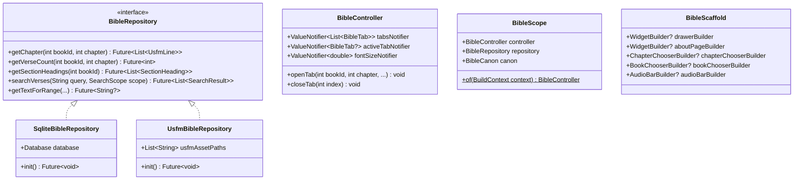

# Composable Flutter Bible App Package: Architecture & Implementation Plan

## Goal Description

The goal is to design and build a composable, highly extensible Flutter package (candidate names: `bible_kit` / `scripture_app`) that enables developers to build custom Bible apps with minimal effort.

The package builds upon the existing text-rendering engine [`scripture`](https://github.com/ethnosdev/scripture) and extracts the battle-tested reading, navigation, annotation, and search features from the [`bsb`](../flutter_app/) project into reusable modules.

### Target Developer Experience

1. **Turnkey ("10 Lines of Code")**: A developer supplies USFM files or a pre-built SQLite database and instantiates `BibleApp(...)` with standard defaults.
2. **Composable ("Mix & Match")**: A developer can assemble their own screens using discrete building blocks (`BibleReader`, `BookChooser`, `ChapterChooser`, `VerseScrubber`, `ChapterTabsBar`).
3. **Extensible ("Slot / Inversion of Control")**: Developers can swap out specific sub-features (e.g., provide a custom `AboutPage`, custom `ChapterChooser`, or custom `Drawer`) without forking the package or breaking core navigation and text layout.
4. **Backward Compatible**: Existing apps like BSB can migrate to the package without breaking their existing SQLite database format, annotations schema, or unique features (such as Greek/Hebrew interlinear study tools).

---

## User Review Required

> [!IMPORTANT]
> **Package Scope & Architecture Decisions**
> 1. **Data Ingestion Model**: Dual support for direct runtime reading of raw USFM files in addition to SQLite databases.
>    - *Recommendation*: Provide a unified `BibleRepository` interface with two implementations: `SqliteBibleRepository` (for pre-compiled DBs, instant random access, and SQLite FTS4 full-text search) and `UsfmBibleRepository` (for drop-in `.usfm` assets, parsing on the fly or caching into an embedded index).
> 2. **State Management & Decoupling from `GetIt`**:
>    - Currently, `bsb` relies on a global `GetIt` service locator (`infrastructure/service_locator.dart`). A public package should not enforce global singletons on consuming applications.
>    - *Recommendation*: Use Flutter's native Inversion of Control (`BibleScope` / `InheritedNotifier` holding `BibleController`). The turnkey `BibleApp` provides this automatically; custom apps can wrap widgets in `BibleScope`.
> 3. **Audio Playback Subsystem**:
>    - Audio playback introduces heavyweight platform dependencies (`just_audio`, `audio_service`, background audio permissions in `AndroidManifest.xml` and `Info.plist`).
>    - *Recommendation*: Keep audio support modular. The core package provides the `AudioPlayerBar` UI widget and an abstract `BibleAudioHandler` / `AudioUrlResolver` interface. Audio playback implementations can be plugged in optionally without bloating apps that only want text reading.
> 4. **Interlinear & Lexicon Tools**:
>    - The current BSB app includes original language tools (Hebrew/Greek, Strong's numbers, lexicons, similar verses).
>    - *Recommendation*: Keep original language tools as an optional study extension rather than a required core dependency, so standard Bible apps remain lightweight.

---

## Open Questions

> [!NOTE]
> 1. **Package Name Preference**: Do you prefer `scripture_app` (maintains symmetry with the existing `scripture` layout engine), `bible_kit`, or `bible_ui`?
> 2. **Repository Location**: Do you envision this as a separate standalone repository (e.g., `github.com/ethnosdev/scripture_app` or `bible_kit`) that `bsb` depends on, or a multi-package monorepo inside `bsb` first?
> 3. **Canon Customization**: Should the canon model support non-Protestant canons (e.g., Catholic/Orthodox deuterocanonical books) and partial canons (e.g., New Testament only, or single-gospel apps)? *(Recommended: Yes, via a configurable `BibleCanon` class).*

---

## Evaluation of the Idea & Current Project State

```mermaid
flowchart TD
    subgraph Current Architecture (bsb)
        A[flutter_app] --> B[database_builder]
        A --> C[scripture layout engine]
        A --> D[Hardcoded GetIt Singletons]
        A --> E[SQLite database.db asset only]
        A --> F[Hardcoded UI Screens & English Canon]
    end

    subgraph Proposed Target Architecture
        PKG[New Package: bible_kit / scripture_app]
        PKG --> C
        PKG --> R[BibleRepository Interface]
        R --> R1[SqliteBibleRepository]
        R --> R2[UsfmBibleRepository]
        PKG --> CT[BibleController & BibleScope]
        PKG --> W[Composable Widgets: Reader, Choosers, Tabs, Scrubber]
        PKG --> BA[Turnkey BibleApp & BibleScaffold with Slot Builders]
        
        APP1[BSB App] --> PKG
        APP2[Custom User App] --> PKG
    end
```

### Current State Assessment

| Component | Current Implementation in `bsb` | Assessment for Package Extraction |
|---|---|---|
| **Text Rendering** | Uses `scripture` package (`UsfmWidget`, `PassageWidget`) | **Ready**. The layout engine is already cleanly separated in `scripture`. |
| **Data Storage** | `DatabaseHelper` hardcodes SQLite asset path, version 29, and table queries | **Coupled**. Needs extraction into an abstract `BibleRepository` with `SqliteBibleRepository` and `UsfmBibleRepository`. |
| **State Management** | Hardcoded `getIt<AppState>()`, `getIt<TabManager>()`, etc. | **Coupled**. Needs extraction into `BibleController` passed down via `BibleScope`. |
| **Book & Chapter Selection** | `BookChooser` (grid & list) and `ChapterChooser` with section headings | **Modular UI, but hardcoded canon**. Can be parameterized with `BibleCanon` and builder delegates. |
| **Tabs & Reading History** | `TabManager`, `ChapterTabsBar`, `ChapterTabsSheet` | **High value**. Tabbed scripture reading is a standout feature that should be a standard component. |
| **Annotations** | `AnnotationService` with highlights, notes, and backup export/import | **Well designed**. Can be extracted with an abstract `AnnotationRepository`. |
| **Search** | `BibleSearchService` using SQLite FTS4 contentless table | **Fast & optimal**. Can be exposed via `BibleSearchDelegate` and `SearchScope`. |
| **Audio** | `bsb_audio_handler.dart`, `AudioPlaybackManager`, `AudioPlayerBottomBar` | **Feature-complete, but platform-heavy**. Best kept as an optional plugin/interface. |

---

## Proposed Architecture



### 1. Extensibility & Slot Architecture

To support swapping out components while maintaining turnkey simplicity, the package adopts the **Slot / Builder Pattern**:

```dart
// Level 1: Minimal One-Liner App
void main() => runApp(
  BibleApp(
    repository: SqliteBibleRepository.fromAsset('assets/bible.db'),
    title: 'My Bible',
  ),
);

// Level 2: Customized App (Swapping About Page & Chapter Chooser)
void main() => runApp(
  BibleApp(
    repository: UsfmBibleRepository.fromDirectory('assets/usfm/'),
    title: 'Custom Bible App',
    // Customization slots:
    aboutPageBuilder: (context) => MyBrandedAboutPage(),
    chapterChooserBuilder: (context, bookId, chapterCount, onSelect) =>
        MyCustomWheelChapterChooser(bookId: bookId, onSelect: onSelect),
    bookChooserBuilder: (context, onSelect) =>
        MyCustomBookGrid(onSelect: onSelect),
    drawerBuilder: (context) => MyCustomNavigationDrawer(),
    actions: [
      IconButton(icon: Icon(Icons.share), onPressed: () => shareApp()),
    ],
  ),
);

// Level 3: Headless / Embedded Composable Widgets
Widget build(BuildContext context) {
  return BibleScope(
    controller: myController,
    repository: myRepository,
    child: Row(
      children: [
        Expanded(child: BookChooser(onSelected: ...)),
        Expanded(child: BibleReader(bookId: 1, chapter: 1)),
      ],
    ),
  );
}
```

---

## Phased Implementation Roadmap

### Phase 1: Core Domain & Data Layer (`bible_kit_core`)
- Define `BibleCanon`, `BookInfo`, `Reference`, `SectionHeading`, `SearchResult`.
- Define `BibleRepository` interface.
- Implement `SqliteBibleRepository`:
  - Directly compatible with the existing `bsb` SQLite schema (table `bible`, `verses_search`, indexes).
  - Ensures existing databases require **zero migration**.
- Implement `UsfmBibleRepository`:
  - Ingests a collection of USFM strings/files.
  - Extracts chapters, verses, and section headings on the fly using `scripture` parser.
- Define `AnnotationRepository` and SQLite implementation for highlights and notes.

### Phase 2: State Management & Scope (`bible_kit_state`)
- Extract `BibleController` (encapsulates tab management, active reading position, font scaling, reader preferences).
- Build `BibleScope` (`InheritedWidget` / `InheritedNotifier`) providing scoped access to controllers and repositories without global singletons.
- Define `BibleTheme` (color palette for highlights, typography defaults, contrast adjustments).

### Phase 3: Composable UI Building Blocks
- Refactor the following standalone widgets to depend on `BibleScope` / parameters instead of global `GetIt`:
  - `BibleReader`: Paged chapter view with swipe navigation, zoom gestures, word selection, and footnotes.
  - `VerseScrubber`: Horizontal / vertical scrubbing bar for rapid verse navigation.
  - `BookChooser`: Grid layout and list layout, canon-aware, customizable colors.
  - `ChapterChooser`: Number pad and grid selector with section heading jump-points.
  - `ChapterTabsBar` & `ChapterTabsSheet`: Multi-tab reading navigation.
  - `BibleSearchPage`: Full-text search interface with scopes (All, OT, NT, Book).
  - `HighlightsAndNotesPage`: Annotation viewer, editor, and backup manager.

### Phase 4: Turnkey App Shell (`BibleScaffold` & `BibleApp`)
- Implement `BibleScaffold`:
  - Houses the top app bar, tab bar, reading canvas, distraction-free toggle, and audio mini-player.
  - Provides builder slots: `aboutPageBuilder`, `drawerBuilder`, `chapterChooserBuilder`, `bookChooserBuilder`, `audioBarBuilder`.
- Implement `BibleApp`:
  - Configures `MaterialApp` with light/dark themes, locale defaults, routing, and lifecycle management.
  - Includes default, high-quality implementations for all slots (Default About Page, Default Drawer, Default Choosers).

### Phase 5: Verification & BSB Dogfooding
- Refactor `flutter_app` in `bsb` to use the new package.
- Confirm all 233 existing widget and unit tests pass.
- Verify that BSB-specific features (Berean About page, Greek/Hebrew study tools, audio URLs) are seamlessly plugged in via the slot builders.

---

## Verification Plan

### Automated Tests
- Unit tests for `SqliteBibleRepository` and `UsfmBibleRepository` verifying parity in chapter extraction, verse counts, and section headings.
- Unit tests for `BibleCanon` verifying standard 66 books, custom book names, and abbreviations.
- Widget tests for `BibleApp`, `BibleScaffold`, and slot builder overrides.
- Full test suite execution:
  ```bash
  cd flutter_app && flutter test
  ```

### Manual Verification
1. **Turnkey Sample Verification**: Run an example app configured with only 10 lines of code using bundled USFM files.
2. **BSB App Regression Verification**: Run the BSB app on iOS/Android simulators, verify:
   - Chapter paging and verse scrubber responsiveness.
   - Highlights and notes persistence.
   - Footnote popups and cross-reference links.
   - Greek/Hebrew interlinear sheet navigation.
   - Audio playback synchronization.
