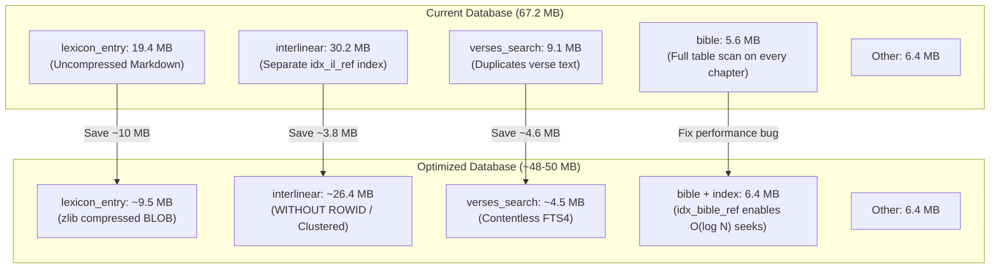

# Database Optimization & FTS Architecture Plan

## Goal Description
Analyze the Berean Standard Bible SQLite database structure (`database.db`, currently 67.2 MB), address the proposal regarding Full-Text Search (FTS) tables and footnotes, and present a structured plan to optimize both storage footprint and query performance across `database_builder` and `flutter_app`.

---

## 1. Direct Answer: The FTS & Footnotes Question

> [!NOTE]
> **Summary**
> You are referring to SQLite FTS **External Content Tables** (`content="table"`) and **Contentless Tables** (`content=""`).
> While pointing FTS directly to the raw `bible` table via `content="bible"` is not viable, switching to a **Contentless FTS Table (`content=""`)** achieves your exact goal: it eliminates the duplicate clean text table, saving **~4.6 MB**, while resolving clean text on demand in ~1 ms.

### What is Happening Right Now
In the current build:
1. The `bible` table (5.6 MB) stores raw USFM lines with footnotes (e.g. `\f + \fr 1:3 \ft Cited in ... \f*`).
2. `createVerseSearchTable` runs `cleanVerseText()` on those lines in Dart memory, stripping footnotes and USFM tags.
3. It inserts the clean verse text into `verses_search` (`CREATE VIRTUAL TABLE verses_search USING fts4(...)`).
4. SQLite FTS4 automatically creates an internal shadow table named `verses_search_content` (4.6 MB) to store that clean text, alongside the inverted index segments (`verses_search_segments`, 4.0 MB).

When viewing the database, both `bible` (with footnotes) and `verses_search_content` (without footnotes) exist simultaneously, duplicating ~4.6 MB of scripture text.

### Can We Delete That Table and Point FTS to `bible`?

#### 1. Simply dropping `verses_search_content`: ❌ Not possible
In standard SQLite FTS4, `verses_search_content` is an internal engine dependency. If you drop it, any query on `verses_search` crashes with `SQL logic error: no such table: verses_search_content`.

#### 2. SQLite External Content Table (`content="bible"`): ❌ Does not work here
In an external content table, SQLite does not create its own content table; instead, whenever a query asks for `SELECT text FROM verses_search`, SQLite reads `bible.text` directly using the matching rowid.
* **Problem A — Row ID Mismatch:** `verses_search` has 31,086 rows (1 per canonical verse). `bible` has 37,843 rows (split by USFM paragraphs, poetry lines, and section headings). The row IDs do not correspond 1-to-1.
* **Problem B — Footnotes & Tags in Search Results:** Because SQLite fetches `text` directly from `bible`, search result snippets, bookmarks, highlights, and modal sheets would display raw USFM tags and footnote text (e.g., `And God said, “Let there be light,”\f + \fr 1:3 \ft Cited in... \f* and there was light.`).
* **Problem C — Token Alignment Breakdown:** FTS generates snippet highlights by tokenizing the external text on the fly. Extra footnote words in `bible` misalign token offsets.

#### 3. SQLite Contentless FTS Table (`content=""`): ✅ Works & Saves ~4.6 MB
SQLite FTS supports `content=""`:
* `verses_search_content` is **never created**.
* Only the inverted index is stored (`verses_search_segments`), saving **~4.6 MB**.
* `SELECT rowid FROM verses_search WHERE verses_search MATCH ?` returns the matching packed `reference` (e.g. `1001003`).
* To display search results in the UI, the app queries `bible` by `reference` and cleans the text on the fly via `cleanVerseText()`.
* **Benchmark:** Fetching 50 verses from `bible` and stripping footnotes with regex in Dart takes **~1–2 ms**, which is negligible for UI responsiveness.

---

## 2. Current Database Layout Analysis (67.2 MB Total)

Querying SQLite's `dbstat` on `database_builder/database.db`:

| Component | Storage Size | % of DB | Purpose & Observations |
|---|---|---|---|
| `interlinear` + 3 indexes | **30.2 MB** | 45.0% | 443,625 word alignment tokens. `idx_il_ref` alone is 5.7 MB because of autoincrement primary key. |
| `lexicon_entry` + 2 indexes | **19.4 MB** | 28.9% | 17,734 lexicon definitions. 15.25 MB is raw uncompressed Markdown. |
| `verses_search` (FTS4) | **9.1 MB** | 13.5% | FTS4 virtual table: 4.6 MB content + 4.0 MB segments + 0.4 MB docsize. |
| `bible` | **5.6 MB** | 8.3% | USFM scripture lines. **Missing index on `reference`!** |
| `original` | **3.8 MB** | 5.7% | 133,054 unique original language forms (vowel points & cantillations). |
| `english` | **2.3 MB** | 3.4% | 102,292 unique English gloss phrases. |
| `pos` | **0.3 MB** | 0.4% | 3,805 parts of speech. |

---

## 3. High-Impact Optimization Opportunities



### Opportunity A: Contentless FTS4 (`content=""`)
* **Savings:** **~4.6 MB** (eliminates `verses_search_content`).
* **Implementation:**
  * Schema: `CREATE VIRTUAL TABLE verses_search USING fts4(text, content='');`
  * Insert: `INSERT INTO verses_search(docid, text) VALUES (reference, cleanText);`
  * Query: Query returns `docid` (packed reference). App resolves text from `bible` on demand.
  * Note on Android: Keeps FTS4 to preserve compatibility with Android's system SQLite.

### Opportunity B: Lexicon Entry Compression (zlib BLOB)
* **Savings:** **~7.0 to ~10.0 MB**
* **Implementation:**
  * In `lexicon_table.dart`, compress `content` with `zlib.encode(utf8.encode(content))` as a SQLite BLOB.
  * In `flutter_app/lib/infrastructure/database.dart`, transparently decode when fetching:
    ```dart
    final raw = row['content'];
    final content = (raw is Uint8List) ? utf8.decode(zlib.decode(raw)) : raw as String;
    ```
  * Lookup latency: < 0.1 ms per word card in the lexicon modal sheet.

### Opportunity C: Clustered Interlinear Table (`WITHOUT ROWID`)
* **Savings:** **~3.8 MB net**
* **Implementation:**
  * Currently, `interlinear` has an autoincrement `_id` and a separate index `idx_il_ref` (5.7 MB).
  * Convert `interlinear` to `PRIMARY KEY (reference, _id) WITHOUT ROWID`.
  * Drop `idx_il_ref`. The primary B-tree is already clustered by `reference`, making verse lookups instant without needing a secondary index.

### Opportunity D: Missing Index on `bible(reference)`
* **Performance Gain:** Fixes a full table scan across 37,843 rows on **every single chapter navigation**, range lookup, and section heading query.
* **Cost:** Only ~860 KB.

---

## User Review Required

> [!IMPORTANT]
> **Compatibility Check (Android SQLite FTS4 vs FTS5)**
> Git history reveals commit `d59671e ("fix sqflite on Android")` switched from FTS5 to FTS4 because certain Android system SQLite builds do not ship with FTS5 enabled.
> We recommend **keeping FTS4** (configured as contentless `content=""`) to guarantee 100% Android compatibility without needing custom native SQLite binaries.

> [!WARNING]
> **Database Version Bump & Asset Replacement**
> Any schema change requires:
> 1. Rebuilding `database.db` via `database_builder/bin/main.dart`.
> 2. Copying the new `database.db` to `flutter_app/assets/database/database.db`.
> 3. Incrementing `_databaseVersion` in `flutter_app/lib/infrastructure/database.dart` so installed apps automatically upgrade their local sandbox copy.

---

## Open Decisions

1. **Optimization Scope:**
   - **Option 1 (Targeted FTS Optimization Only):** Implement Contentless FTS4 + on-the-fly text cleaning + `bible` index. (Saves ~4.6 MB, fixes chapter scan performance).
   - **Option 2 (Comprehensive Optimization - Recommended):** Implement Contentless FTS4 + Lexicon zlib compression + Interlinear clustered table + `bible` index. (Saves **~17–20 MB**, bringing the app download and install footprint down from 67 MB to ~48 MB).

---

## Proposed Changes

### Component 1: `database_builder`
#### [MODIFY] [schema.dart](file:///Users/suragch/Dev/ethnosdev/bsb/database_builder/lib/src/schema.dart)
- Update `createVerseSearchTable` to `fts4(text, content="")`.
- Update `createInterlinearTable` to `WITHOUT ROWID` with `PRIMARY KEY (reference, _id)` and remove `idx_il_ref`.
- Add `CREATE INDEX IF NOT EXISTS idx_bible_ref ON bible(reference);`.
- Update `lexicon_entry.content` column to accept `BLOB`.

#### [MODIFY] [verse_search_table.dart](file:///Users/suragch/Dev/ethnosdev/bsb/database_builder/lib/src/verse_search_table.dart)
- Update insert statement to insert `(docid, text)` using `reference` as `docid`.

#### [MODIFY] [lexicon_table.dart](file:///Users/suragch/Dev/ethnosdev/bsb/database_builder/lib/src/lexicon/lexicon_table.dart)
- Compress `content` with `zlib.encode(utf8.encode(content))` before inserting.

#### [MODIFY] [database_helper.dart](file:///Users/suragch/Dev/ethnosdev/bsb/database_builder/lib/src/database_helper.dart)
- Update prepared statements for contentless FTS, compressed lexicon, and clustered interlinear.

---

### Component 2: `flutter_app`
#### [MODIFY] [database.dart](file:///Users/suragch/Dev/ethnosdev/bsb/flutter_app/lib/infrastructure/database.dart)
- Bump `_databaseVersion`.
- Update `searchVerses`: Query `docid` from `verses_search`, retrieve matching verse lines from `bible` by `reference`, and assemble clean text via `cleanVerseText()`.
- Update `getVerseText(int reference)`: Read directly from `bible` where `reference = ?` and clean with `cleanVerseText()`.
- Update `getLexiconContent` / `getLexiconContentByLemma`: Decompress `zlib` BLOB if content is binary bytes.

---

## Verification Plan

### Automated Tests
1. **Database Builder Unit Tests:**
   ```bash
   cd database_builder && dart test
   ```
   - Verify `verse_search_table_test.dart` passes with contentless FTS4.
   - Verify `database_test.dart` verifies index integrity, lexicon retrieval, and reference lookups.
2. **Flutter App Unit & Integration Tests:**
   ```bash
   cd flutter_app && flutter test
   ```
   - Verify `bible_search_service_test.dart` and `search_page_test.dart`.
   - Verify `hebrew_greek_test.dart` (interlinear and lexicon lookups).
   - Verify `highlights_and_notes_page_test.dart` (`getVerseText` calls).

### Manual Verification
1. Open search in Flutter app and search for words (e.g. `light`, `faith`, `"in the beginning"`): verify result counts, snippets, and highlights are clean without USFM tags or footnotes.
2. Open Hebrew/Greek interlinear on Genesis 1:1 and John 1:1: verify tokens, glosses, and lexicon bottom sheets render correctly.
3. Verify chapter navigation speed and smooth scrolling to verses.
