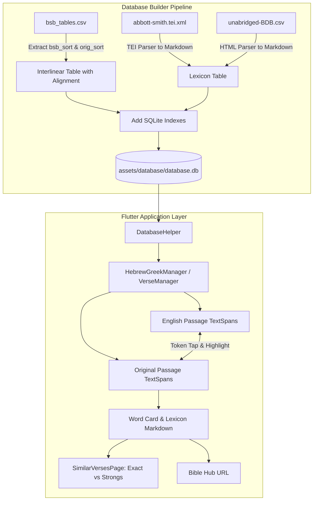

# Feature Specification & Implementation Plan: Hebrew/Greek & Lexicon Enhancements

## 1. Executive Summary & Goals

This document specifies the architecture and implementation plan for modernizing the Hebrew and Greek study experience in the Berean Standard Bible (BSB) app.

### Core Objectives
1. **Dual Passage Presentation**: Transition from the current inline interlinear format (`word (gloss) word (gloss)`) to two separate, fluent passages:
   - **Passage 1**: The verse rendered in standard, natural English.
   - **Passage 2**: The verse rendered in the original Hebrew/Aramaic (RTL) or Greek (LTR) using appropriate typography (`Ezra` and `Galatia` font families).
2. **Synchronized Word Highlighting**: 
   - Tapping any word in English highlights it in English and simultaneously highlights the corresponding word in Hebrew or Greek.
   - Tapping any word in Hebrew or Greek highlights it and simultaneously highlights the corresponding word in English.
3. **Embedded Offline Lexicons**:
   - Embed **Abbott-Smith's Manual Greek Lexicon of the New Testament** for Greek NT words.
   - Embed the **Brown-Driver-Briggs (BDB) Hebrew and English Lexicon** for Old Testament Hebrew and Aramaic words.
   - Strip verbose source formatting and store clean, styled Markdown (preserving bold headwords/grammatical markers, italicized glosses, and hierarchical definition outlines) directly in app assets.
4. **Enhanced Occurrence Search**:
   - Allow users to find other biblical references matching:
     - **Exact inflected surface form** (e.g. all 45 instances of *וַיֹּ֥אמֶר*).
     - **Same Strong's number / root lemma** (e.g. all instances of root *אָמַר* / H559).
5. **Direct Bible Hub Integration**:
   - Provide direct shortcuts to view exhaustive concordance and lexical data on Bible Hub for any Strong's number.

---

## 2. Technical Findings & Codebase Analysis

### 2.1. Current Implementation
- **Screen**: [`HebrewGreekScreen`](file:///Users/suragch/Dev/ethnosdev/bsb/flutter_app/lib/ui/hebrew_greek/hebrew_greek_screen.dart) uses a horizontal `PageView` allowing users to swipe through verses in the active chapter.
- **Interlinear Manager**: [`VersePageManager`](file:///Users/suragch/Dev/ethnosdev/bsb/flutter_app/lib/ui/hebrew_greek/verse_page_manager.dart) builds a single unified `TextSpan` where each original word is immediately followed by `(english gloss)` if enabled.
- **Similar Verses**: [`SimilarVersesPage`](file:///Users/suragch/Dev/ethnosdev/bsb/flutter_app/lib/ui/hebrew_greek/similar_verses/similar_verses_page.dart) queries `getVersesWithStrongNumber(language, strongsNumber)` to find matches by Strong's number only.

### 2.2. Critical Discoveries
1. **Existing Word Alignment Data in `bsb_tables.csv`**:
   - [`bsb_tables.csv`](file:///Users/suragch/Dev/ethnosdev/bsb/database_builder/bsb_tables/bsb_tables.csv) contains explicit sort order columns:
     - Column 0: `Heb Sort` (original Hebrew order)
     - Column 1: `Greek Sort` (original Greek order)
     - Column 2: `BSB Sort` (the exact word order in the English translation)
   - Sorting the tokens of a verse by `BSB Sort` perfectly reconstructs the fluent English text of the Berean Standard Bible word for word, giving an exact 1:1 bidirectional mapping to the original Hebrew/Greek tokens!
2. **Missing Database Indexes**:
   - The current `interlinear` table in [`database.db`](file:///Users/suragch/Dev/ethnosdev/bsb/database_builder/database.db) (443,625 rows) lacks indexes on `reference`, `strongs`, and `original`.
   - Tapping a verse currently triggers a full table scan across nearly half a million rows. Adding SQLite indexes will turn these queries into instant (<1ms) indexed lookups.
3. **Lexicon Coverage & Data Footprint**:
   - **Abbott-Smith** ([`abbott-smith.tei.xml`](file:///Users/suragch/Dev/ethnosdev/bsb/database_builder/lexicon/abbott-smith.tei.xml)): 6,195 entries; covers **99.7%** of all Greek Strong's numbers in the NT. Stripped Markdown size is **~1.6 MB**.
   - **BDB** ([`unabridged-BDB-Hebrew-lexicon.csv`](file:///Users/suragch/Dev/ethnosdev/bsb/database_builder/lexicon/unabridged-BDB-Hebrew-lexicon.csv)): 10,022 entries covering both Biblical Hebrew and Biblical Aramaic; covers **99.4%** of all Hebrew/Aramaic Strong's numbers in the OT. Stripped Markdown size is **~7.8 MB**.
   - **Total uncompressed size**: **~9.4 MB**. Inside SQLite, this adds only ~9 MB to the asset database (which compresses down to ~3 MB in the app bundle).

---

## 3. Architecture & Data Pipeline



---

## 4. Detailed Component Design

### 4.1. Database Builder (`database_builder`)

#### A. Updated Schema ([`schema.dart`](file:///Users/suragch/Dev/ethnosdev/bsb/database_builder/lib/src/schema.dart))
Add `bsb_sort` to `interlinear` and introduce `lexicon_entry`:

```sql
-- Updated Interlinear Table
CREATE TABLE IF NOT EXISTS interlinear (
  _id INTEGER PRIMARY KEY AUTOINCREMENT,
  reference INTEGER NOT NULL,
  language INTEGER NOT NULL,    -- 0: Hebrew, 1: Aramaic, 2: Greek
  original INTEGER NOT NULL,     -- FK to original table
  pos INTEGER NOT NULL,          -- FK to pos table
  strongs INTEGER NOT NULL,
  english INTEGER NOT NULL,      -- FK to english table
  punctuation TEXT,
  bsb_sort INTEGER NOT NULL      -- English sort order
);

CREATE INDEX IF NOT EXISTS idx_il_ref ON interlinear(reference);
CREATE INDEX IF NOT EXISTS idx_il_strongs ON interlinear(language, strongs);
CREATE INDEX IF NOT EXISTS idx_il_original ON interlinear(original);

-- Lexicon Entries Table
CREATE TABLE IF NOT EXISTS lexicon_entry (
  _id INTEGER PRIMARY KEY AUTOINCREMENT,
  language INTEGER NOT NULL,     -- 0: Hebrew, 1: Aramaic, 2: Greek
  strongs INTEGER NOT NULL,
  lemma TEXT NOT NULL,
  content TEXT NOT NULL          -- Formatted Markdown
);

CREATE INDEX IF NOT EXISTS idx_lex_strongs ON lexicon_entry(language, strongs);
CREATE INDEX IF NOT EXISTS idx_lex_lemma ON lexicon_entry(lemma);
```

#### B. Lexicon Text Cleaning to Markdown
- **Abbott-Smith Converter (`abbott_smith_parser.dart`)**:
  - `<orth>` $\rightarrow$ `**lemma**` (bold)
  - `<gloss>`, `<emph>` $\rightarrow$ `*gloss*` (italics)
  - `<sense n="...">` $\rightarrow$ indented definition outline (`1.`, `2.`, `(a)`, etc.)
  - `<seg type="septuagint">` $\rightarrow$ Septuagint usage notes preserved
  - `<re>` $\rightarrow$ Synonyms section formatted cleanly
- **BDB Converter (`bdb_parser.dart`)**:
  - Strip website boilerplate navigation headers (`<h1><entry>...`, `<div class="navigation">`).
  - `<highlightword>` $\rightarrow$ `**definition**` (bold)
  - `<b>` (parts of speech, stems like Qal, Niphal) $\rightarrow$ `**stem**` (bold)
  - `<highlight>` $\rightarrow$ `*gloss*` (italics)
  - `<div class="point">` $\rightarrow$ `• 1. ...` (bullet outline)
  - `<placeholder\d+/>` $\rightarrow$ stripped clean
  - Retain embedded Hebrew (`<bdbheb>`), Aramaic (`<bdbarc>`), and Greek (`<grk>`) characters.

---

### 4.2. Flutter Application Data Layer (`flutter_app`)

#### A. Database Queries ([`database.dart`](file:///Users/suragch/Dev/ethnosdev/bsb/flutter_app/lib/infrastructure/database.dart))
1. **Retrieve Aligned Verse Tokens**:
   ```dart
   Future<List<AlignedWordToken>> getAlignedVerseTokens(Reference reference);
   ```
   Each token contains:
   - `id`: Unique token row ID.
   - `originalText`: Hebrew/Greek surface form.
   - `englishText`: BSB English gloss/phrase.
   - `bsbSort`: Sort order for English text.
   - `origSort`: Sort order for Hebrew/Greek text.
   - `punctuation`: Trailing punctuation mark.
   - `strongsNumber`: Strong's number.
   - `partOfSpeech`: Grammatical parsing.
   - `language`: Hebrew, Aramaic, or Greek.
   - `isUntranslated`: Boolean flag for markers/articles (`english == '-'`).

2. **Retrieve Lexicon Markdown**:
   ```dart
   Future<String?> getLexiconEntry(Language language, int strongsNumber);
   ```

3. **Retrieve Exact Form References**:
   ```dart
   Future<List<Reference>> getVersesWithExactWord(int originalWordId);
   ```

---

### 4.3. User Interface Design

#### A. Dual Passage Screen Layout ([`hebrew_greek_screen.dart`](file:///Users/suragch/Dev/ethnosdev/bsb/flutter_app/lib/ui/hebrew_greek/hebrew_greek_screen.dart))
The screen maintains the horizontal swiping between verses (`PageView.builder`) while replacing the interlinear text with two distinct passage blocks:

1. **English Passage Card**:
   - Rendered using interactive `TextSpan`s ordered by `bsb_sort`.
   - Punctuation attached naturally so it reads like standard text.
   - Untranslated words (`-`) are omitted from the English text flow.
   - Tapping an English word sets `selectedTokenId`. The tapped word receives a prominent selection highlight (e.g. secondary container / primary background).

2. **Original Language Passage Card**:
   - Rendered using interactive `TextSpan`s ordered by original text order.
   - Text direction: RTL for Hebrew/Aramaic (`Ezra` font), LTR for Greek (`Galatia` font).
   - The token matching `selectedTokenId` is highlighted simultaneously in real-time.
   - Tapping any Hebrew/Greek word also sets `selectedTokenId`, highlighting both languages.

3. **Word Details & Lexicon Panel**:
   - Positioned below the passages in a dedicated scrollable card:
     - **Headword**: Original word in large font, with transliteration (Greek) and English translation.
     - **Grammar & Strong's**: Part of speech chip and Strong's number badge.
     - **Action Row**:
       - 🔍 **Exact Form**: Button showing total occurrences of this exact form; taps to open `SimilarVersesPage` in exact mode.
       - 📚 **Root / Strong's**: Button showing total occurrences of this root; taps to open `SimilarVersesPage` in Strong's mode.
       - 🌐 **Bible Hub**: Direct external link button with icon to open the Strong's page on Bible Hub.
     - **Lexicon Entry**: Full, rich Markdown view rendered using `flutter_markdown`, showing Abbott-Smith (for Greek) or BDB (for Hebrew/Aramaic) with all definition senses and sub-points.

#### B. Enhanced Similar Verses Page ([`similar_verses_page.dart`](file:///Users/suragch/Dev/ethnosdev/bsb/flutter_app/lib/ui/hebrew_greek/similar_verses/similar_verses_page.dart))
- Add a top Segmented Control / TabBar:
  - **Tab 1: Same Strong's (#...)**: Lists all verses containing the root lemma.
  - **Tab 2: Exact Form (...)**: Lists all verses containing the exact same surface word form.
- Each result item shows:
  - Reference header (e.g. `Genesis 1:3`).
  - Aligned verse text with the target word highlighted.
- App bar action: Quick launch to Bible Hub for that word.

---

## 5. Implementation Phases

| Phase | Milestone | Tasks |
|:---|:---|:---|
| **1** | **Database Alignment & Builder** | • Update `schema.dart` with `bsb_sort` and `lexicon_entry` table.<br>• Add SQLite indexes to `interlinear` and `lexicon_entry`.<br>• Write `abbott_smith_parser.dart` and `bdb_parser.dart` in `database_builder`.<br>• Regenerate `database.db`.<br>• Follow [`howto_update_bsb_text.md`](file:///Users/suragch/Dev/ethnosdev/bsb/docs/howto_update_bsb_text.md) to delete the old asset database, copy the new one to `flutter_app/assets/database/database.db`, and increment `_databaseVersion` in `database.dart`. |
| **2** | **App Infrastructure & Queries** | • Add `AlignedWordToken` model.<br>• Add `getAlignedVerseTokens`, `getLexiconEntry`, and `getVersesWithExactWord` to `DatabaseHelper`.<br>• Add `flutter_markdown` dependency to `pubspec.yaml`. |
| **3** | **Dual Passage & Synchronized Highlighting** | • Update `VersePageManager` to manage aligned tokens and selected token state.<br>• Build English passage widget and Original passage widget with bidirectional tap handlers.<br>• Handle untranslated particles and typography. |
| **4** | **Lexicon & Word Detail Panel** | • Build the word summary card and action buttons.<br>• Embed Markdown lexicon view rendering Abbott-Smith or BDB content.<br>• Connect Bible Hub external launcher. |
| **5** | **Exact Form & Similar Verses Search** | • Upgrade `SimilarVersesPage` with tabs for Exact Form vs Same Strong's.<br>• Add verse snippet preview with target word highlighting. |
| **6** | **Verification & Polish** | • Test OT (Hebrew/Aramaic) and NT (Greek) across diverse chapters.<br>• Verify memory efficiency, fast swiping, and theme compatibility (light/dark mode). |

---

## 6. Recommendations & Design Considerations

1. **Integrated SQLite vs Separate Files**:
   - Storing lexicons in `database.db` is strongly recommended over separate JSON files. SQLite enables instantaneous indexed lookups, requires zero memory overhead when idle, and leverages the app's existing database copy & update routine.
2. **Database Indexing**:
   - Adding indexes on `interlinear(reference)`, `interlinear(original)`, and `interlinear(language, strongs)` is an immediate priority that transforms query performance from hundreds of milliseconds to under 1 millisecond.
3. **Handling Untranslated Words**:
   - Words like the Hebrew direct object marker *et* (`אֵת`) or untranslated Greek articles have no direct representation in the English text flow. When tapped in the Hebrew/Greek passage, the UI should indicate "(Untranslated particle / marker in English)" in the word detail card while displaying its full lexical entry.
4. **Markdown Rendering**:
   - Using `flutter_markdown` ensures standard, reliable styling for italics, bolding, bullet points, and verse cross-references across Android, iOS, and macOS.
