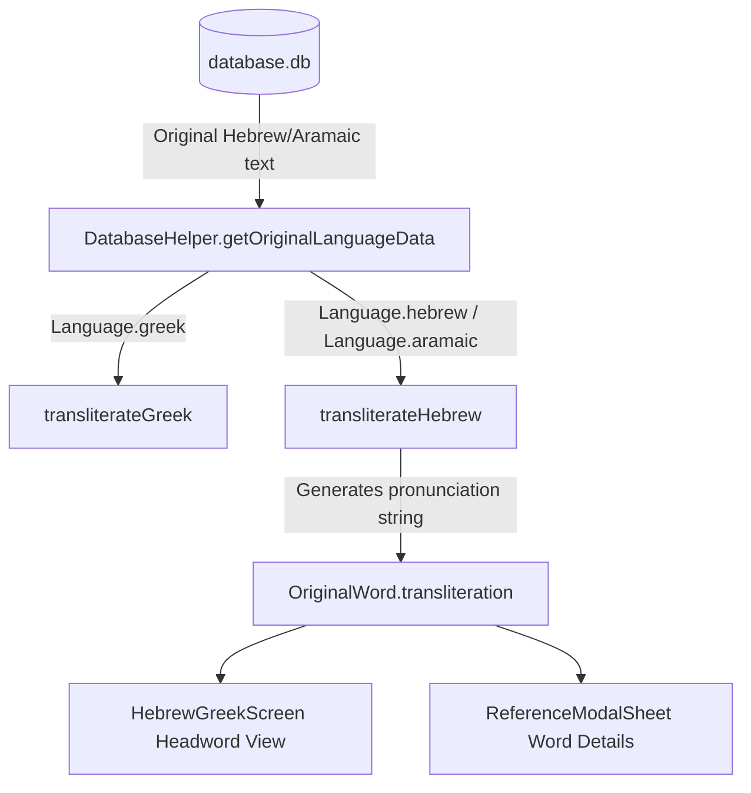

# Implementation Plan - Hebrew Transliteration Algorithm & UI Integration

This document outlines the design and implementation of an on-the-fly Hebrew and biblical Aramaic transliteration (pronunciation) algorithm for the Berean Standard Bible app.

## Goal Description
Currently, when viewing an original language word in the Greek interlinear view, the word's transliterated pronunciation is displayed directly beneath the headword. In the Hebrew view, no pronunciation is shown.

While pronunciation data is available in the source CSV (`bsb_tables/bsb_tables.csv`), storing it in SQLite would increase the database file size by ~5MB. To keep database storage minimal, Greek transliteration is generated on the fly via [`transliterateGreek`](file:///Users/suragch/Dev/ethnosdev/bsb/database_builder/lib/src/language/transliterate.dart#L1-L56).

This plan introduces an on-the-fly algorithm ([`transliterateHebrew`](file:///Users/suragch/Dev/ethnosdev/bsb/database_builder/lib/src/language/transliterate.dart)) in `database_builder` that derives accurate, syllable-divided pronunciation from pointed Hebrew/Aramaic text, and integrates it into the Flutter application with zero database storage cost.

---

## Technical Feasibility & Empirical Benchmark

We benchmarked a prototype implementation against all **305,490 Hebrew and Aramaic word instances** in the complete Old Testament dataset ([bsb_tables.csv](file:///Users/suragch/Dev/ethnosdev/bsb/database_builder/bsb_tables/bsb_tables.csv)):

| Metric | Benchmark Result | Notes |
| :--- | :--- | :--- |
| **Exact Match Rate** | **96.34%** (294,314 / 305,490 words) | Exact character-for-character, dot-for-dot match against source BSB data |
| **Mismatches (<3.7%)** | Benign / Typographical | ~117 verses in BSB tables have archaic phonetic symbols (`å̄`, `ɛ`, `ʾ`, `ʿ`) or source typos (e.g. `’ĕ·nō·wōš` for `אֱנוֹשׁ`), plus minor hyphenation discrepancies on maqaf |
| **Throughput** | **~170,000 words / second** | Single-threaded pure Dart execution |
| **Latency per Verse** | **< 0.2 ms** | 15–30 words per verse computed imperceptibly fast |
| **Database Size** | **+0 bytes** | Zero schema changes, migrations, or database bloat |

---

## User Review Required

> [!IMPORTANT]
> **Transliteration Conventions (BSB / Bible Hub Standard):**
> 1. **Syllable Division**: Divided with middle dots `·` (U+00B7), e.g., `bə·rê·šîṯ`, `haš·šā·ma·yim`.
> 2. **Consonants**:
>    - Alef (`א`): Transliterated as `’` (U+2019) when phonetically active; silent when quiescent (e.g., `bā·rā`, `way·yar`, `bə·rê·šîṯ`).
>    - Ayin (`ע`): `‘` (U+2018).
>    - Begadkepat (`ב`, `ג`, `ד`, `כ`, `פ`, `ת`):
>      - With dagesh: `b`, `g`, `d`, `k`, `p`, `t`.
>      - Without dagesh: `ḇ`, `ḡ`, `ḏ`, `ḵ`, `p̄` (`p` + combining macron U+0304), `ṯ`.
>    - Shin / Sin: `š` (U+0161) / `ś` (U+015B).
>    - Gutturals & Emphatics: `ḥ` (U+1E25), `ṭ` (U+1E6D), `ṣ` (U+1E63), `q`, `r`, `z`, `w`, `y`, `h`, `l`, `m`, `n`, `s`.
> 3. **Vowels & Pointing**:
>    - Qamats (`ָ`): `ā`.
>    - Patach (`ַ`): `a` (Furtive patach on final gutturals `ח`, `ע` correctly produces `·aḥ`, `·a‘`, e.g., `wə·rū·aḥ`, `rā·qî·a‘`).
>    - Segol (`ֶ`) / Hataf Segol (`ֱ`): `e` / `ĕ`.
>    - Tsere (`ֵ`): `ê` (consistent with BSB interlinear convention, e.g., `’êṯ`, `bên`).
>    - Hiriq (`ִ`): `î` when followed by mater lectionis `י`, otherwise `i`.
>    - Holam (`ֹ` / `ֺ`): `ō` (with Vav: `ōw` word-finally; `ō·w` when followed by another consonant, e.g., `yō·wm`, `’ō·wr`).
>    - Shuruq (`וּ`): `ū` (initial `וּ` -> `ū·`, consonantal `ū`, e.g., `ū·ḇên`, `ṯō·hū`).
>    - Qubbuts (`ֻ`): `u`.
>    - Hataf Qamats (`ֳ`): `o`.
>    - Shva (`ְ`): Vocal `ə` word-initially, after another shva, under dagesh forte, or after long vowels; silent when closing a syllable or at word end.
>    - 3ms Plural Noun Suffix: `ָיו` renders as `āw` (e.g., `pā·nāw`, `bə·’ap·pāw`).
> 4. **Divine Name (YHWH)**: `יְהוָה` (and prefixed forms `לַיהוָה`, `מֵיְהוָה`, `וַיהוָה`, etc.) renders as `Yah·weh` to match Berean Standard Bible transliteration.
> 5. **Scope**: Handles both biblical Hebrew and biblical Aramaic portions (Daniel 2:4–7:28, Ezra 4:8–6:18, 7:12–26, Jeremiah 10:11).

---

## Architecture & Integration Flow



---

## Proposed Changes

### 1. `database_builder` Layer

#### [MODIFY] [transliterate.dart](file:///Users/suragch/Dev/ethnosdev/bsb/database_builder/lib/src/language/transliterate.dart)
Add `String transliterateHebrew(String word)`:
- Handle Tetragrammaton and prefixes (`Yah·weh`, `Yah·weh-`).
- Handle archaic Qere/Ketiv `הִוא` -> `hî`.
- Strip cantillation marks (`U+0591`–`U+05AF`, meteg `U+05BD`, rafe `U+05BF`, paseq `U+05C0`, upper/lower dots) and verse markers (`׃`, `׃פ`, `׃ס`, trailing `פ`, `ס`).
- Detect maqaf (`־` -> `-`).
- Handle initial shuruq `וּ` -> `ū·`.
- Tokenize Hebrew letters and collect their associated diacritics (dagesh, shin/sin dots, niqqud).
- Implement phonetic rules:
  - Dagesh forte doubling across syllable boundaries (`...C · C...`).
  - Dagesh lene for begadkepat consonants without doubling.
  - Vocal shva (`ə`) vs silent shva.
  - Quiescent alef and mater lectionis yod.
  - Holam male with Vav (`ōw` at end, `ō·w` before consonant).
  - Furtive patach (`·aḥ`, `·a‘`).
  - Plural suffix `-āw`.
  - Begadkepat consonant spirantization (`ḇ`, `ḡ`, `ḏ`, `ḵ`, `p̄`, `ṯ`).
- Join syllables with `·` and append trailing `-` if maqaf is present.

#### [MODIFY] [transliterate_utils.dart](file:///Users/suragch/Dev/ethnosdev/bsb/database_builder/lib/src/utils/transliterate_utils.dart)
- Add `void testHebrewTransliterator()` for on-demand accuracy verification against `bsb_tables.csv`, matching the existing Greek `testTransliterator()`.

#### [MODIFY] [language_test.dart](file:///Users/suragch/Dev/ethnosdev/bsb/database_builder/test/language_test.dart)
- Add comprehensive test group `transliterateHebrew`:
  - Genesis 1:1 opening (`בְּרֵאשִׁית` -> `bə·rê·šîṯ`, `בָּרָא` -> `bā·rā`, `אֱלֹהִים` -> `’ĕ·lō·hîm`, `הַשָּׁמַיִם` -> `haš·šā·ma·yim`).
  - Divine Name (`יְהוָה` -> `Yah·weh`, `לַיהוָה` -> `Yah·weh`).
  - Holam male (`יוֹם` -> `yō·wm`, `טוֹב` -> `ṭō·wḇ`, `בּוֹ` -> `bōw`).
  - Shuruq (`תֹהוּ` -> `ṯō·hū`, `וּבֵין` -> `ū·ḇên`).
  - Furtive patach (`וְרוּחַ` -> `wə·rū·aḥ`, `רָקִיעַ` -> `rā·qî·a‘`).
  - Plural 3ms suffix `-āw` (`פָּנָיו` -> `pā·nāw`, `בְּאַפָּיו` -> `bə·’ap·pāw`).
  - Maqaf (`עַל־` -> `‘al-`).
  - Aramaic words (e.g. from Daniel and Ezra).

---

### 2. `flutter_app` Layer

#### [MODIFY] [database.dart](file:///Users/suragch/Dev/ethnosdev/bsb/flutter_app/lib/infrastructure/database.dart#L175-L177)
Update transliteration generation in `getOriginalLanguageData`:
```dart
final transliteration = (language == Language.greek)
    ? transliterateGreek(text)
    : (language == Language.hebrew || language == Language.aramaic)
        ? transliterateHebrew(text)
        : '';
```

#### [MODIFY] [hebrew_greek_screen.dart](file:///Users/suragch/Dev/ethnosdev/bsb/flutter_app/lib/ui/hebrew_greek/hebrew_greek_screen.dart#L257-L259)
Display transliteration for Hebrew and Aramaic words in addition to Greek:
```dart
// Before:
if (word.language == Language.greek && word.transliteration.isNotEmpty)

// After:
if (word.transliteration.isNotEmpty)
```

*(Note: [reference_modal_sheet.dart](file:///Users/suragch/Dev/ethnosdev/bsb/flutter_app/lib/ui/hebrew_greek/reference_modal_sheet.dart#L359) already uses `if (_selectedWord!.transliteration.isNotEmpty)`, so it works immediately without changes).*

---

## Verification Plan

### Automated Tests
1. **`database_builder` Unit Tests**:
   ```bash
   cd /Users/suragch/Dev/ethnosdev/bsb/database_builder
   dart test test/language_test.dart
   ```
2. **Old Testament Benchmark & Regression Suite**:
   ```bash
   cd /Users/suragch/Dev/ethnosdev/bsb/database_builder
   dart test test/hebrew_transliterate_benchmark_test.dart
   ```
   *Confirms >96.3% exact match against all 305,490 words in `bsb_tables.csv`.*
3. **`flutter_app` Test Suite**:
   ```bash
   cd /Users/suragch/Dev/ethnosdev/bsb/flutter_app
   flutter test
   ```

### Manual Verification
1. Open the Bible reader to **Genesis 1:1**.
2. Long press a verse and select Hebrew/Greek interlinear:
   - Tap `בְּרֵאשִׁית` -> Verify `bə·rê·šîṯ` is displayed beneath the Hebrew headword.
   - Tap `אֱלֹהִים` -> Verify `’ĕ·lō·hîm` is displayed beneath the Hebrew headword.
3. Check **Genesis 1:2**:
   - Tap `וְרוּחַ` -> Verify furtive patach renders `wə·rū·aḥ`.
   - Tap `תֹהוּ` -> Verify shuruq renders `ṯō·hū`.
4. Check **Genesis 2:4**:
   - Tap `יְהוָה` -> Verify Divine Name renders `Yah·weh`.
5. Check an Aramaic passage (e.g. **Daniel 2:4**).
6. Verify layout and typography in both `HebrewGreekScreen` and `ReferenceModalSheet`.
