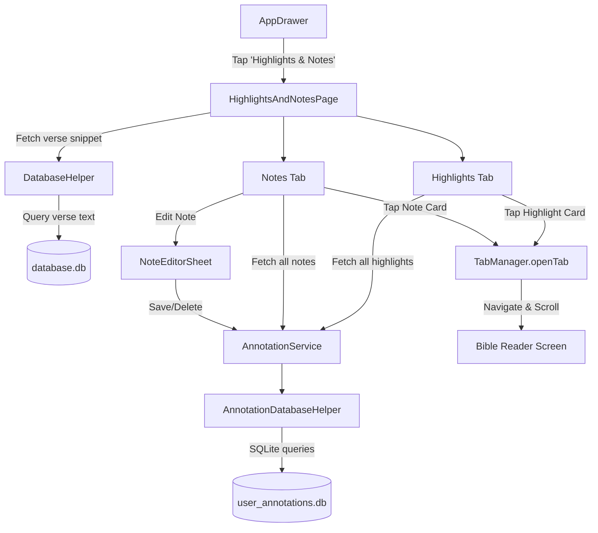

# Implementation Plan - Highlights and Notes in Menu Drawer

This plan details the implementation of a new menu drawer option allowing users to view, manage, and navigate to all their saved highlights and notes in the Berean Standard Bible app.

## Goal Description
Users currently have the ability to highlight verses and attach notes in the text reader, but there is no centralized screen to see all their highlights and notes. This feature adds:
1. A **"Highlights & Notes"** option to the main navigation drawer (`AppDrawer`).
2. A dedicated **`HighlightsAndNotesPage`** displaying all saved highlights and notes in a tabbed interface.
3. Fast verse text preview, color indicators, sorting (by recency or biblical order), editing/deleting capabilities, and direct navigation to the selected scripture verse in the Bible reader.

---

## User Review Required

> [!IMPORTANT]
> **Key Design Decisions:**
> 1. **Drawer Menu Title**: We propose **"Highlights & Notes"** placed right after **"Search"** in the navigation drawer.
> 2. **Screen Structure**: A tabbed screen with **"Highlights"** and **"Notes"** tabs:
>    - **Highlights tab**: Shows verse reference, color swatch, scripture snippet, and creation/update timestamp.
>    - **Notes tab**: Shows verse reference, note text, scripture snippet, timestamp, and an edit button.
> 3. **Navigation Behavior**: Tapping a highlight or note immediately navigates the Bible reader to that book, chapter, and verse (`TabManager.openTab(bookId, chapter, null, verse)`), closing the drawer/page.
> 4. **Sort Options**: An action in the AppBar permitting users to sort by **Biblical order** (default), **Newest first**, or **Oldest first**. Selected preference is saved to `UserSettings` and remembered across sessions.

---

## Architecture & Flow



---

## Proposed Changes

### 1. Data Layer (`lib/infrastructure`)

#### [MODIFY] [annotation_database.dart](file:///Users/suragch/Dev/ethnosdev/bsb/flutter_app/lib/infrastructure/annotation_database.dart)
Add database query methods to retrieve all highlights and notes:
```dart
Future<List<Highlight>> getAllHighlights({String orderBy = 'updated_at DESC'}) async {
  final db = await database;
  final maps = await db.query(
    'highlights',
    orderBy: orderBy,
  );
  return maps.map((m) => Highlight.fromMap(m)).toList();
}

Future<List<Note>> getAllNotes({String orderBy = 'updated_at DESC'}) async {
  final db = await database;
  final maps = await db.query(
    'notes',
    orderBy: orderBy,
  );
  return maps.map((m) => Note.fromMap(m)).toList();
}
```

#### [MODIFY] [annotation_service.dart](file:///Users/suragch/Dev/ethnosdev/bsb/flutter_app/lib/infrastructure/annotation_service.dart)
Expose methods on `AnnotationService` and add single highlight deletion:
```dart
Future<List<Highlight>> getAllHighlights({String orderBy = 'updated_at DESC'}) {
  return _dbHelper.getAllHighlights(orderBy: orderBy);
}

Future<List<Note>> getAllNotes({String orderBy = 'updated_at DESC'}) {
  return _dbHelper.getAllNotes(orderBy: orderBy);
}

Future<void> deleteHighlight(String id) async {
  await _dbHelper.deleteHighlight(id);
  _notifyChange();
}
```

---

### 2. UI Layer (`lib/ui`)

#### [NEW] [highlights_and_notes_page.dart](file:///Users/suragch/Dev/ethnosdev/bsb/flutter_app/lib/ui/annotations/highlights_and_notes_page.dart)
Create a new tabbed screen with:
- **Tabs**: `Highlights` and `Notes` using `TabBar` and `TabBarView`.
- **AppBar**:
  - Title: `"Highlights & Notes"`.
  - Sort popup menu: `"Newest first"`, `"Oldest first"`, `"Biblical order"`.
- **Highlights Tab**:
  - Displays cards for each highlight with:
    - Left colored vertical bar matching the highlight's color.
    - Scripture reference title (e.g., `John 3:16–17`).
    - Verse snippet text retrieved via `DatabaseHelper.getVerseText`.
    - Formatted timestamp.
    - Delete button (with confirmation dialog).
    - Tapping card navigates to chapter & scrolls to verse via `TabManager.openTab(bookId, chapter, null, verse)`.
  - Empty state when no highlights exist.
- **Notes Tab**:
  - Displays cards for each note with:
    - Note icon and Scripture reference title.
    - Note content preview.
    - Scripture passage text snippet.
    - Timestamp.
    - Edit button (opens `NoteEditorSheet`).
    - Delete button (with confirmation dialog).
    - Tapping card navigates to chapter & scrolls to verse.
  - Empty state when no notes exist.
- **Reactivity**: Listens to `AnnotationService.changeNotifier` to automatically refresh whenever a highlight or note is added, edited, or deleted.

#### [MODIFY] [drawer.dart](file:///Users/suragch/Dev/ethnosdev/bsb/flutter_app/lib/ui/home/drawer.dart)
Add `ListTile` for "Highlights & Notes" under "Search":
```dart
ListTile(
  leading: const Icon(Icons.edit_note),
  title: const Text('Highlights & Notes'),
  onTap: () {
    Navigator.pop(context);
    Navigator.push(
      context,
      MaterialPageRoute(
        builder: (context) => const HighlightsAndNotesPage(),
      ),
    );
  },
),
```

---

### 3. Tests & Verification

#### [MODIFY] [annotation_service_test.dart](file:///Users/suragch/Dev/ethnosdev/bsb/flutter_app/test/annotation_service_test.dart)
Update `FakeAnnotationDbHelper` to implement `getAllHighlights` and `getAllNotes`, and add unit tests verifying retrieval and deletion.

#### [NEW] [highlights_and_notes_page_test.dart](file:///Users/suragch/Dev/ethnosdev/bsb/flutter_app/test/highlights_and_notes_page_test.dart)
Add widget tests covering:
- Drawer item navigates to `HighlightsAndNotesPage`.
- Tab switching between Highlights and Notes.
- Highlights list rendering, empty states, and deletion.
- Notes list rendering, note editing via `NoteEditorSheet`, and deletion.
- Tapping a card triggers `TabManager.openTab` with the correct book, chapter, and verse.

---

## Verification Plan

### Automated Tests
1. Run all unit and widget tests:
   ```bash
   flutter test
   ```
2. Verify static analysis:
   ```bash
   dart analyze
   ```

### Manual Verification
1. Open the app drawer, verify "Highlights & Notes" appears below "Search".
2. Tap "Highlights & Notes" to open the screen.
3. Verify empty states when no highlights/notes exist.
4. Create a highlight in Genesis 1:1 and a note in John 3:16.
5. Re-open Highlights & Notes, verify both items appear in their respective tabs with correct colors, references, text snippets, and timestamps.
6. Tap a highlight to verify it navigates to Genesis 1 and scrolls to verse 1.
7. Edit a note from the Notes tab, verify updates persist immediately.
8. Delete an item, verify it is removed cleanly.
