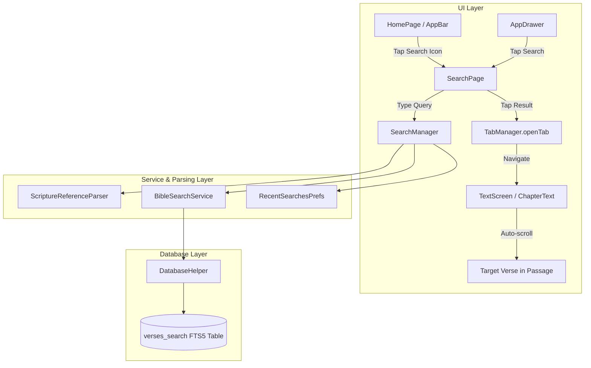

# Feature Specification & Implementation Plan: Bible Search

## 1. Overview & Goal

Add a fast, accurate, and intuitive search experience to the Berean Standard Bible app. The search system provides:
1. **Keyword & Phrase Full-Text Search**: Search scripture text for single words, multiple terms, or exact phrases (e.g. `faith`, `"in the beginning"`, `grace and truth`).
2. **Direct Scripture Reference Parsing**: Recognize scripture references and common abbreviations (e.g., `John 3:16`, `Jn 3:16`, `Gen 1`, `Rom 8:28`, `Psalm 23`), presenting a direct "Jump to passage" shortcut card.
3. **Scope Filtering**: Filter search results by **All**, **Old Testament**, **New Testament**, or **Current Book**.
4. **Contextual Highlighting**: Render clean search result snippets with matched words/phrases highlighted in the theme's accent color.
5. **Tap-to-Navigate with Auto-Scroll**: Tapping any search result or reference card opens that chapter in a tab and automatically scrolls smoothly to the target verse.
6. **Search History & Suggestions**: Save recent searches locally for quick re-use when the search bar is empty.

---

## 2. Architecture & Design Decisions

### 2.1. Full-Text Search Index (SQLite FTS5)
* **Problem**: The raw `bible` table contains 68,821 rows because verses are split across lines for poetry, paragraph boundaries, and break markers. Furthermore, rows include USFM footnote tags (`\f + \fr 1:3 \ft ... \f*`). Querying the raw table with `LIKE '%query%'` misses phrases that span line breaks, matches footnote text, and cannot leverage ranking.
* **Solution**: An FTS5 virtual table `verses_search` containing clean, aggregated verse text (with footnotes stripped):
  ```sql
  CREATE VIRTUAL TABLE verses_search USING fts5(
    reference UNINDEXED,
    book_id UNINDEXED,
    chapter UNINDEXED,
    verse UNINDEXED,
    text
  );
  ```
* **Performance**: Sub-millisecond queries (~1ms) across all 31,086 verses, native BM25 relevance ranking, and exact phrase matching with quotes.
* **Compatibility & Migration**:
  * **Build-time**: `database_builder` populates `verses_search` during database generation.
  * **Runtime fallback**: When `DatabaseHelper.init()` runs in `flutter_app`, if `verses_search` is missing (e.g. from an older database copy), it automatically populates the table in a quick ~400ms background transaction, guaranteeing instant compatibility.

### 2.2. Unified Root Navigation & Entry Points
* **AppBar Search Action**: A search icon (`Icons.search`) in the main `AppBar` actions, accessible both when tabs are open and when on the home `BookChooser`.
* **Side Drawer**: A "Search" tile in `AppDrawer` for discoverability.
* **Search Page**: A dedicated `SearchPage` with a clean search input, scope chips, live results count, and rich result tiles.
* **Result Selection**: Tapping a result invokes `TabManager.openTab(bookId, chapter, null, targetVerse)`, closes the search screen, and animates `ChapterText`'s scroll controller to the target verse.

---

## 3. Detailed Component Plan



### 3.1. Database & Search Layer
* **`database_builder/lib/src/schema.dart`**:
  * Define `verses_search` virtual table schema and query templates.
* **`database_builder/lib/src/create_database.dart`**:
  * Populate `verses_search` during DB creation by aggregating clean verse text without footnotes.
* **`flutter_app/lib/infrastructure/database.dart`**:
  * Ensure `verses_search` exists upon opening database.
  * Add `searchVerses({required String query, SearchScope scope, int? specificBookId, int limit})`.
  * Sanitize user input for FTS5 syntax safety (quotes, punctuation, wildcards).

### 3.2. Reference Parsing & Search Service
* **`flutter_app/lib/infrastructure/search/search_models.dart`**:
  * Data structures for `SearchResult`, `SearchScope` (`all`, `ot`, `nt`, `book`), and `ParsedReference`.
* **`flutter_app/lib/infrastructure/search/scripture_reference_parser.dart`**:
  * Flexible case-insensitive parser for:
    * Standard book names (`Genesis`, `John`, `1 Corinthians`, `Psalms`)
    * Standard abbreviations (`Gen`, `Jn`, `1Cor`, `1 Co`, `Mt`, `Matt`, `Lk`, `Rom`, `Ps`, `Prov`, `Rev`)
    * Chapter-only references (`John 3`, `Psalm 23`, `Gen 1`)
    * Verse references (`John 3:16`, `1 Cor 13:4`, `Rom 8:28`)
* **`flutter_app/lib/infrastructure/search/bible_search_service.dart`**:
  * Orchestrates search queries, reference shortcuts, and match range extraction for UI highlighting.
* **`flutter_app/lib/infrastructure/service_locator.dart`**:
  * Register `BibleSearchService`.

### 3.3. Reader Auto-Scroll to Target Verse
* **`flutter_app/lib/ui/tabs/bible_tab.dart`**:
  * Add `int? targetVerse` to `BibleTab`.
* **`flutter_app/lib/ui/tabs/tab_manager.dart`**:
  * Update `openTab` to accept optional `targetVerse`.
* **`flutter_app/lib/ui/text/chapter/chapter_text.dart`**:
  * Implement `_scrollToTargetVerse(int verse)`:
    * Traverse `RenderPassage` children (`RenderParagraph`) to find the matching `RenderVerseNumber` or `RenderWord`.
    * Calculate child offset and invoke `_scrollController.animateTo(...)` smoothly.

### 3.4. Search UI & Experience
* **`flutter_app/lib/ui/search/search_page.dart`**:
  * Search bar with smart autofocus (focused when query is empty, unfocused when resuming a session to keep results in view), clear button (`X`), and debounced search updates (250ms).
  * Filter chips: `All`, `Old Testament`, `New Testament`, `Current Book`.
  * Direct reference match card at top of list (e.g. "Jump to John 3:16" with preview).
  * Unlimited search results list showing reference title, clean verse text, and highlighted match tokens.
  * Empty query state with recent searches and tips.
  * No-results state with helpful suggestions.
* **`flutter_app/lib/ui/search/search_manager.dart`**:
  * State management for query, scope, history, and results.
  * **Session Persistence (Approach A)**: Registered as an application-level singleton in GetIt. Preserves current query, active scope filter, loaded results list, and exact `scrollOffset` across page transitions. When a user taps a result and navigates to the passage, returning to Search restores their exact previous view. Tapping the clear button (`X`) resets the session.
* **`flutter_app/lib/ui/home/home.dart` & `drawer.dart`**:
  * Add search icon button to `AppBar` and tile to `AppDrawer`.

---

## 4. Verification & Testing

### Automated Tests
* **`test/scripture_reference_parser_test.dart`**:
  * Validate parsing of full names, abbreviations, chapter-only queries, and case variations.
* **`test/bible_search_service_test.dart`**:
  * Validate keyword search, exact phrase matching, scope filtering (OT/NT/Book), and match spans.
* **`test/search_page_test.dart`**:
  * Widget test for searching, scope switching, tapping a result, and tapping a reference jump card.
* **`test/chapter_text_scroll_test.dart`**:
  * Verify `ChapterText` scrolls to the given `targetVerse`.

### Manual Verification
* Perform keyword search (e.g. `grace`) and exact phrase search (e.g. `"in the beginning"`).
* Switch scope filters between All, Old Testament, and New Testament.
* Type reference queries like `Jn 3:16` and tap the jump card to verify instant navigation to John 3:16.
* Verify recent searches appear when the query is cleared.
